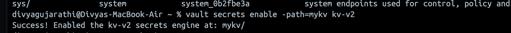
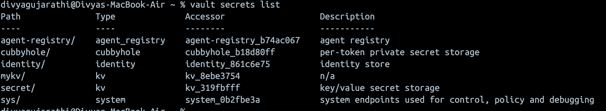
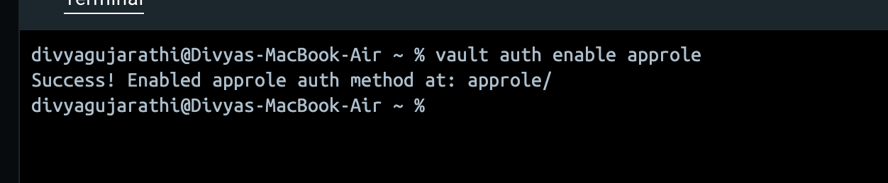
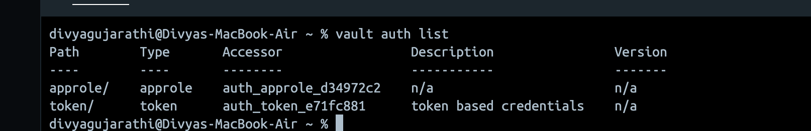
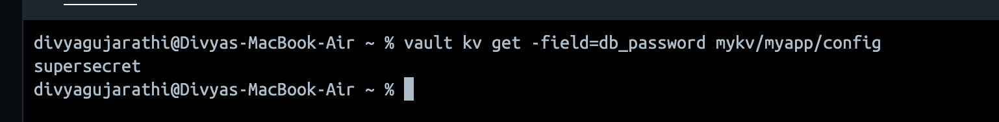
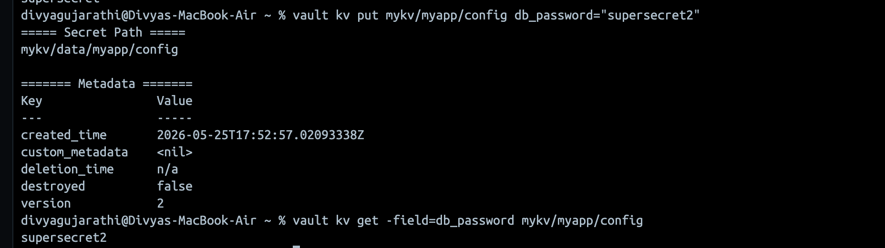

# Task 1 — HashiCorp Vault Setup

## Overview

This task demonstrates setting up HashiCorp Vault locally using Docker, initializing it in dev mode, enabling a KV v2 secrets engine, configuring AppRole authentication, and storing and retrieving a secret.

---

## Prerequisites

- Docker installed and running
- Vault CLI installed

---

## Step 1 — Start Vault in Docker

```bash
docker run --cap-add=IPC_LOCK -d \
  --name=dev-vault \
  -p 8200:8200 \
  hashicorp/vault
```


**Why `--cap-add=IPC_LOCK`?**
This grants Vault permission to lock memory pages, preventing secrets from being swapped to disk unencrypted. In production, this is critical.

**Why Docker?**
In production, Vault always runs containerized. Using Docker locally mirrors that pattern rather than running a raw binary.

---

## Step 2 — Retrieve the Root Token

```bash
docker logs dev-vault 2>&1 | grep "Root Token"
```

Expected output:
```
Root Token: hvs.XXXXXXXXXXXXXXXX
```

---

## Step 3 — Configure the Environment variables & CLI

```bash
export VAULT_ADDR='http://127.0.0.1:8200'
export VAULT_TOKEN='hvs.XXXXXXXXXXXXXXXX'   # replace with your token
```

Verify Vault is running and unsealed:

```bash
vault status
```

Output:
```
ey             Value
---             -----
Seal Type       shamir
Initialized     true
Sealed          false
Total Shares    1
Threshold       1
Version         2.0.1
Build Date      2026-05-19T17:20:48Z
Storage Type    inmem
Cluster Name    vault-cluster-d1c07dbc
Cluster ID      c627f564-95fb-dc85-33fc-6e0c64f711c8
HA Enabled      false
```

**What "Sealed" means:**
A sealed Vault cannot read or write any secrets. In dev mode, Vault auto-unseals on startup. In production, unsealing requires a quorum of unseal key holders (Shamir's Secret Sharing) — no single person can unseal Vault alone.

---

## Step 4 — Enable KV v2 Secrets Engine

```bash
vault secrets enable -path=mykv kv-v2
```


Verify it's enabled:

```bash
vault secrets list
```



---

## Step 5 — Enable AppRole Auth Method

```bash
vault auth enable approle
```



**What is AppRole?**
AppRole is an auth method designed for machine-to-machine authentication (applications, CI/CD pipelines, services). Instead of a username/password, it uses a `RoleID` (like a username) and a `SecretID` (like a password). Neither alone is enough — both are required, and they're delivered to the application via separate channels (dual control).

This is preferred over static tokens for applications because SecretIDs can be rotated, scoped, and expire automatically.

Verify it's enabled:

```bash
vault auth list
```



---

## Step 6 — Store a Secret

```bash
vault kv put mykv/myapp/config \
  db_password="supersecret" \
```

This stores  key-value pair for db_password at the path `mykv/myapp/config`.

Output:
```
===== Secret Path =====
mykv/data/myapp/config

======= Metadata =======
Key                Value
---                -----
created_time       2026-05-25T17:46:17.261204417Z
custom_metadata    <nil>
deletion_time      n/a
destroyed          false
version            1
```

---

## Step 7 — Retrieve the Secret

```bash
vault kv get -field=db_password mykv/myapp/config
```



---

## Step 7 — Create new version of the Secret (Added to check functionality - for fun :)

```bash
vault kv put mykv/myapp/config db_password="supersecret2" 
vault kv get -field=db_password mykv/myapp/config 
```




