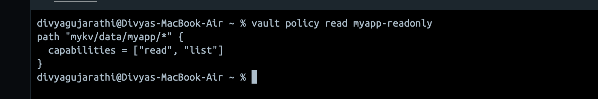
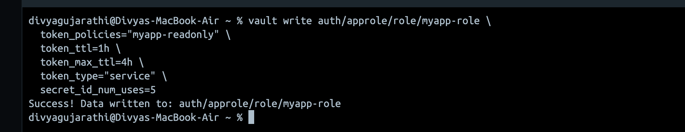
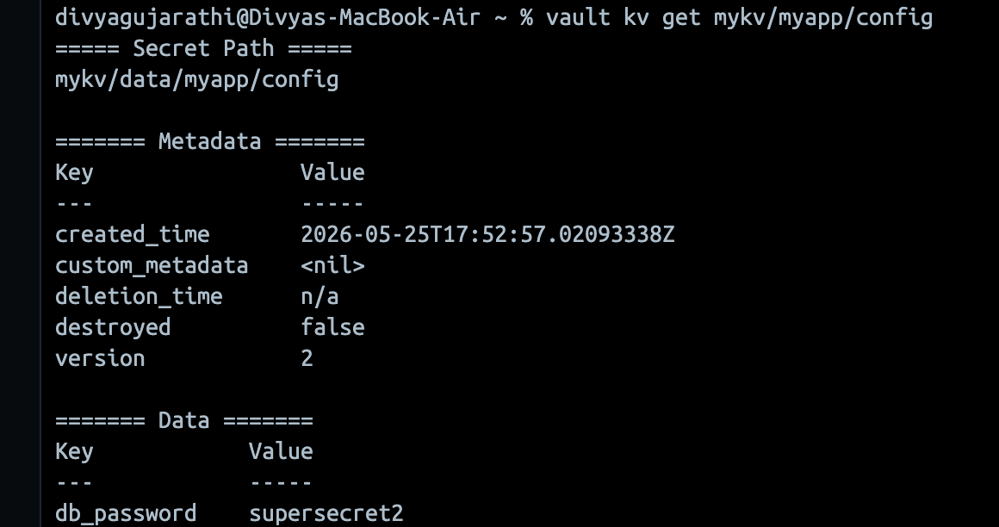
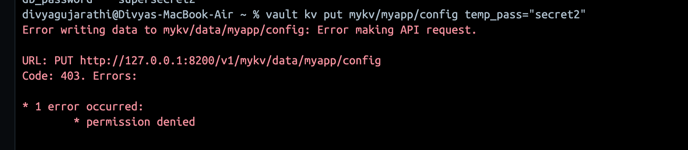

# Task 2 — HashiCorp Vault Policy & IAM

## Overview

This task demonstrates creating a read-only Vault policy, mapping it to an AppRole auth role, and explains key Vault IAM concepts including token types, TTL, audit logging, and secret rotation.

**Prerequisites:** Vault must be running from Task 1 with KV v2 enabled at `mykv/` .

---

## Step 1— Create the Read-Only Policy

Create a file called `readonly-policy.hcl` as provided in this folder:

```hcl
path "mykv/data/myapp/*" {
  capabilities = ["read", "list"]
}
```

Vault stores data at `mykv/data/myapp/config` internally. Policies must use the real API path. The `*` wildcard covers all secrets under `myapp/`.

**Why only `read` and `list`?**
This follows the principle of least privilege — the application can read secrets it needs but cannot create, modify, or delete them. 

Apply the policy to Vault:

```bash
vault policy write myapp-readonly readonly-policy.hcl
```


Verify:

```bash
vault policy list
vault policy read myapp-readonly
```


---

## Step 2 — Create AppRole and Map the Policy

```bash
vault write auth/approle/role/myapp-role \
  token_policies="myapp-readonly" \
  token_ttl=1h \
  token_max_ttl=4h \
  token_type="service" \
  secret_id_num_uses=5
```



**Breakdown:**

This commands creates an approle with name `myapp-role` and is of type service. It has a TTL of 1 hour that means it will expire after 1 hour of inactivity and cannot live beyond 4 hours.  `secret_id_num_uses` = 5 has been set so that the token can be used only 5 times in the next few tasks before expiring. `secret_id_num_uses` would be set to `1` in production.

---

## Step 3— Fetch RoleID and SecretID

```bash
# Get the RoleID
vault read auth/approle/role/myapp-role/role-id

# Generate a SecretID
vault write -f auth/approle/role/myapp-role/secret-id
```

---

## Step 4 — Log in with AppRole

```bash
vault write auth/approle/login \
  role_id="<role-id>" \
  secret_id="<secret-id>"
```

Export the token from the response:

```bash
export VAULT_TOKEN="<token from login response>"
```

---

## Step 5— Test the Policy


```bash
vault kv get mykv/myapp/config
```



When trying to  write — permissions are denied as expected:
```bash
vault kv put mykv/myapp/config temp_pass="secret2"
```




## Explanations

### Token Types — Service vs Batch

Service support renewal and revocation, making them suitable for long-running applications. They can be tracked and are suitable for long-running applications. 
Batch tokens are encrypted blobs and they require no storage on disk to track them. They are better for high-throughput workloads like Lambda functions where millions of short-lived tokens are created rapidly.

---

### Token TTL and Renewal

- **`token_ttl`** — the initial lifetime of a token. After this period the token expires unless renewed.
- **`token_max_ttl`** — the hard ceiling. A token cannot be renewed beyond this point regardless of how many times it has been renewed.
- **Renewal** — before a token expires, an application can call `vault token renew` to reset the TTL clock back to `token_ttl`. This continues until `token_max_ttl` is reached.

```
Created → [token_ttl: 1h] → Renew → [token_ttl: 1h] → Renew → [token_max_ttl: 4h hit] → Expired
```

This forces applications to re-authenticate periodically, limiting the blast radius if a token is compromised.

---

### Orphan Tokens

By default, tokens in Vault have a parent-child relationship. When a parent token is revoked, all its child tokens are revoked too.

An orphan token has no parent, it exists independently and is not revoked when any other token is revoked. Orphan tokens are useful for long-running and independent services. They can only expire via TTL or explicit revocation. Orphan tokens need to be used carefully because they have no parent, they can only expire via TTL or explicit revocation.

```bash
# Create an orphan token
vault token create -orphan -policy="myapp-readonly"
```

---

### Audit Logging

Audit logs record the details of every request received and response sent by the Vault API. This is critical for compliance and incident response. By default, this is disabled. It can be a file, syslog server or a socket.

Enable the file audit device:

```bash
vault audit enable file file_path=/vault/logs/audit.log
```

**Why it matters:**
- Detect unauthorized access attempts
- Prove compliance during audits
- Trace exactly which token accessed which secret and when

In production, audit logs should be shipped to a SIEM (e.g. Splunk, Datadog) in real time. 

---

### Secret Rotation Approach

Secret rotation is the process of replacing an old secret with a new one before it can be exploited. Auto-rotating and Dynamic Secrets are different strategies for accomplishing the same goal.

**Auto Rotating:**
- Rotated on a schedule in a background job
- When a rotation happens, a new credential is stored as the latest active version of the secret and the older version (as set)  becomes inactive.
-  They can be securely synced into the configured third-party destination if secret sync is set up.

**Dynamic secrets (preferred in production):**
- Generated just-in-time upon retrieval. A unique short lived token is generated for every request.
- When the lease expires, Vault automatically revokes the credentials at the source and is easy to trace.

---


