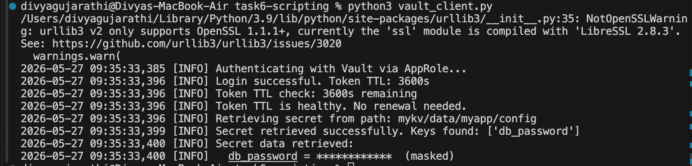
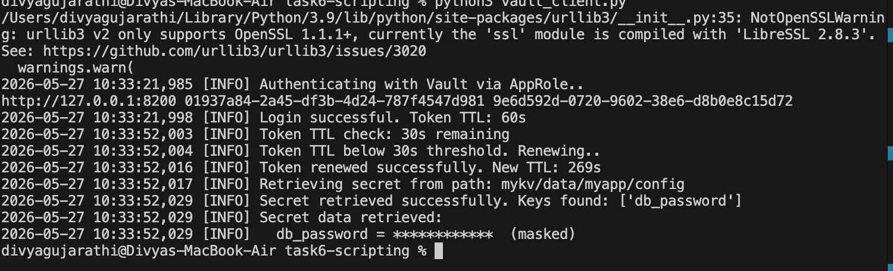

# Vault AppRole Client

A Python script that authenticates to HashiCorp Vault using AppRole authentication and retrieves secrets from a KV v2 secret engine.

## Features

- **AppRole Authentication**: Secure authentication using RoleID and SecretID
- **Automatic Retry Logic**: Handles transient network failures with configurable retries
- **Error Handling**: Error handling for timeouts, connection errors, and HTTP errors
- **Logging**: Detailed logging for debugging and monitoring
- **Token Management**: Retrieves and manages Vault tokens with TTL information

## Prerequisites

- Python 3.9+
- requests, hvac and dotenv libraries
- HashiCorp Vault server running and accessible
- Valid AppRole credentials (RoleID and SecretID)

## Installation

1. Install required dependencies:
   ```bash
   pip install -r requirements.txt
   ```

2. Set up environment variables: 

  Create a `.env` file in the project directory:
   ```bash
   VAULT_ADDR=http://127.0.0.1:8200
   VAULT_ROLE_ID=your-role-id
   VAULT_SECRET_ID=your-secret-id
   ```
Environment variables are managed using a `.env` file and loaded securely with `python-dotenv`. Sensitive credentials are excluded from version control using `.gitignore`.

## Configuration

Edit the constants in `vault_client.py` to customize behavior:

- `SECRET_PATH`: Path to the secret in Vault (In this case: `mykv/data/myapp/config`)
- `RENEW_BEFORE`: Seconds before TTL expiration to renew token (default: 300s)
- `TIMEOUT`: HTTP request timeout in seconds (default: 30)
- `MAX_RETRIES`: Number of retry attempts for failed requests (default: 3)
- `RETRY_DELAY`: Delay between retries in seconds (default: 2)

## Usage

Run the script:
```bash
python vault_client.py
```

The script will:
1. Authenticate with Vault using AppRole
2. Check token TTL and automatically renew if below threshold
3. Retrieve the secret from the configured path
4. Display the secret keys (values masked in logs for security)
5. Automatically retry on transient failures (timeouts, connection errors)

## How Token Renewal Works

The script implements automatic token lifecycle management:

- When authenticated, the script tracks token creation time and TTL
- Before retrieving secrets, it calculates remaining TTL
- If remaining TTL falls below `RENEW_BEFORE` threshold, the token is automatically renewed
- Token renewal extends the expiration by 1 hour (`increment='1h'`)
- Script continues with the renewed token and updated TTL info

**Example Log Output:**

Retrieval without token extension - 



Retrieval with token extension - 



## Troubleshooting

### 400 Bad Request Error
- Verify `VAULT_ROLE_ID` and `VAULT_SECRET_ID` environment variables are set correctly
- Ensure AppRole auth method is enabled in Vault: `vault auth enable approle`
- Check that the RoleID and SecretID are valid and not expired

### 403 Forbidden Error
- Verify the token's policy has read access to the secret path
- Check Vault policy configuration

### 404 Not Found Error
- Verify the secret exists at the configured `SECRET_PATH`
- Ensure the path format is correct for KV v2 engine (e.g., `mykv/data/myapp/config`)


## Logging

The script logs all operations at INFO level by default.

To change log level, modify the `basicConfig` in the script:
```python
logging.basicConfig(level=logging.DEBUG)  # More verbose
```

## License

Internal use only.